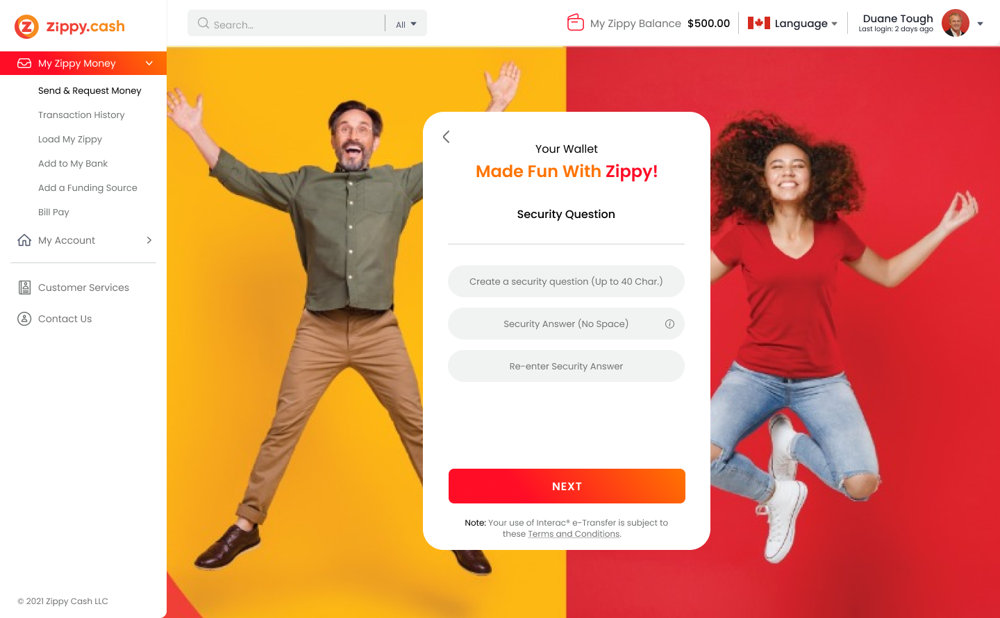
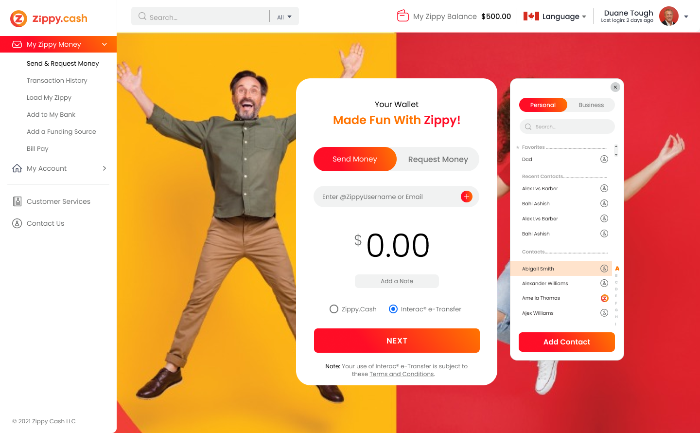
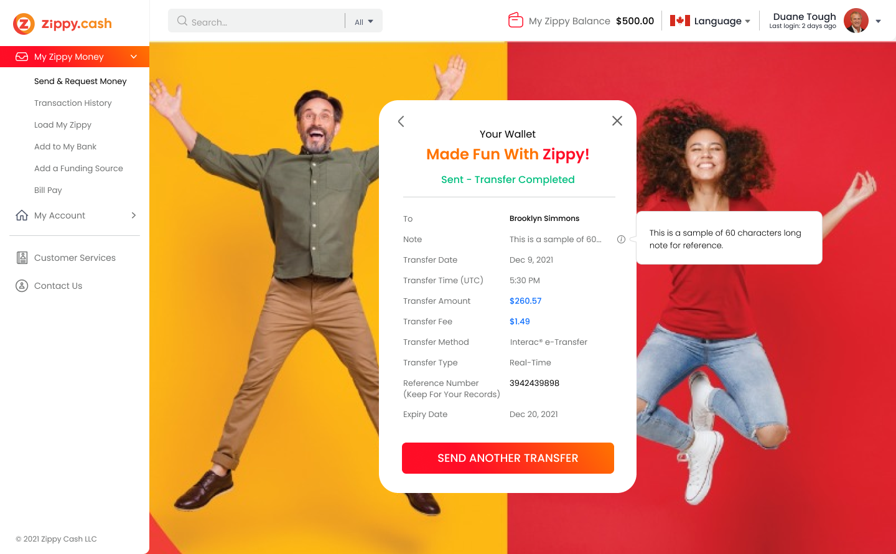
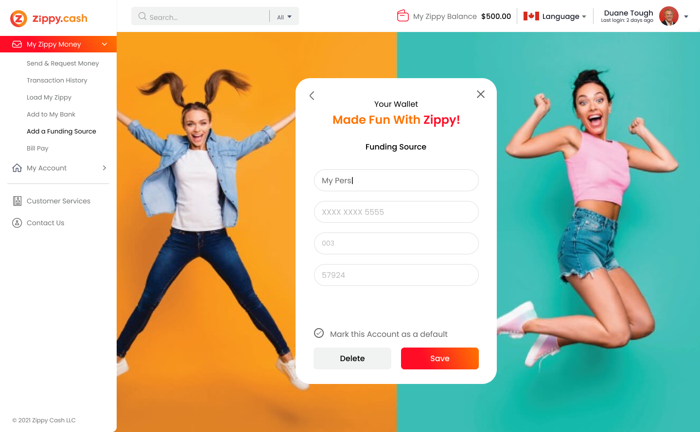

### Description
For the ZCash fintech startup, I was hired as a Lead Developer and Technical Architect to build the prototype, to eliminate project delays on both the Front-end (React, Jest, Storybook) and Back-end (C#, .Net Core).

### Tech
C#, .NET Core, MVC, React, Mobile app development, Web development

### High-level architecture
[Zippy Cash AML Diagram](./Zippy Cash AML Diagram.pdf)

### Mockup

